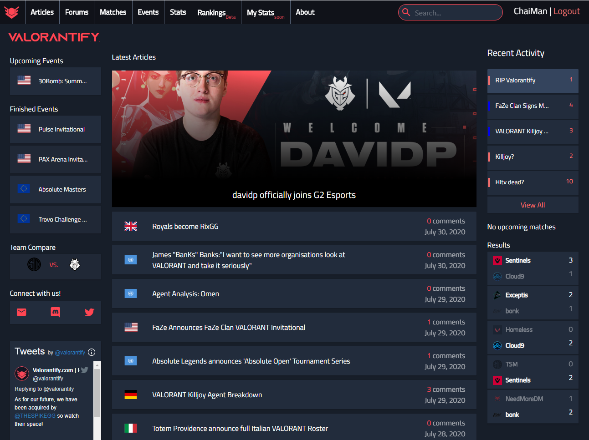
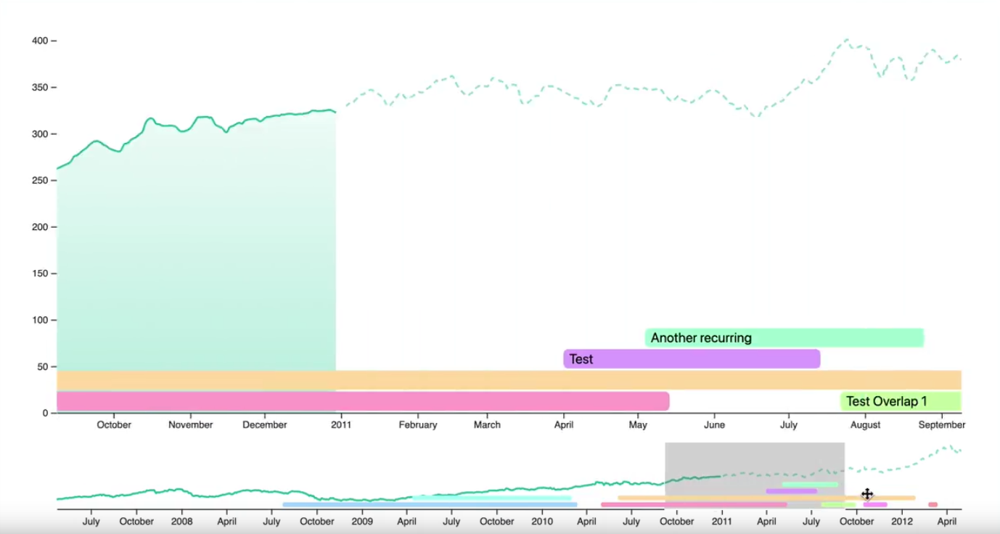
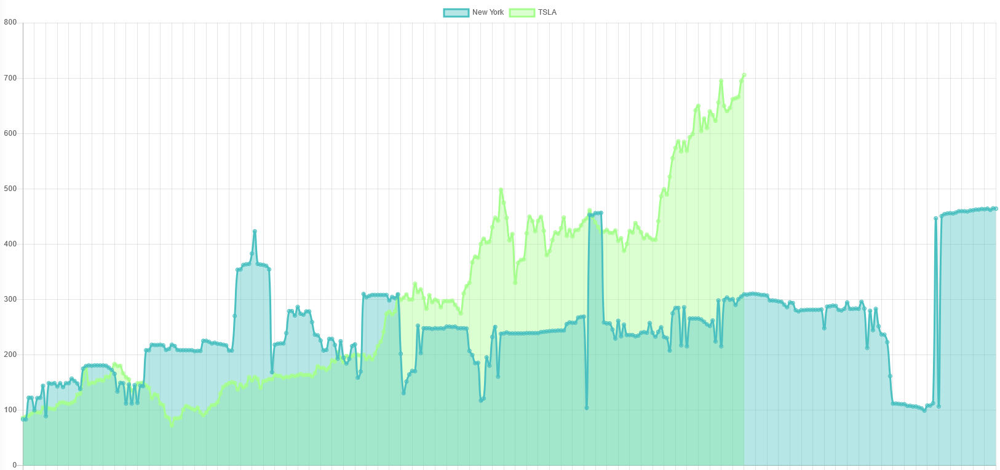

I received a BS in Computer Science and BA in History from the University of Central Florida in May 2021.

I will be returning to Texas Instruments as a Software Engineer in July 2021. 

From June 2020 to August 2020, I worked as a Software Engineer Intern at Texas Instruments in the ERP Operations Team.

Since April 2021, I have been a member of the [UCF Security and Analytics Lab](http://seal.cs.ucf.edu), supervised by Professor [David Mohaisen](http://cs.ucf.edu/~mohaisen/). 

Since June 2020, I have been a member of the [UCF Computational Biology Lab](https://server.cs.ucf.edu/compbio/), headed by Professor [Wei Zhang](https://www.cs.ucf.edu/~wzhang/). I work primarily under [Jiao Sun](https://server.cs.ucf.edu/compbio/people/).

Since January 2020, I have been a member of the [UCF Evolutionary Computation Lab](http://www.cs.ucf.edu/~ecl/index.html), headed by Professor [Annie Wu](http://www.cs.ucf.edu/~aswu/).

More info on my research work can be found [here](/research.md).

## Publications
**William Chen**, Brett Fazio. [Morphologically-Guided Segmentation For Translation of Agglutinative Low-Resource Languages](https://wanchichen.github.io/pdf/morpho_nmt.pdf). _The 4th Workshop on Technologies for MT of Low Resource Languages_, 2021. (In press)

Khandakar Tanvir Ahmed, Jiao Sun, **William Chen**, Irene Martinez, Sze Cheng, Wencai Zhang, Jeongsik Yong, and Wei Zhang. [In Silico Model for miRNA-mediated Regulatory Network in Cancer](https://github.com/compbiolabucf/PTNet). _Briefings in Bioinformatics_, 2021. (In press)

## Portfolio

---

### Startups

---

[uBump.co](https://shop.ubump.co) August 2020 - April 2021

I worked with [Brennen Fountain](https://www.linkedin.com/in/brennen-fountain-743302149/) and [Brett Fazio](https://www.linkedin.com/in/brett-fazio/) to create uBump, an NFC oriented social media sharing site.

Users can simply tap their NFC stickers against a smartphone and instantly share all of their socials. Sample uBump Profile available [here](https://ubump.co/william).

uBump was sold to [Bolstered Equity Group](https://www.crunchbase.com/acquisition/bolstered-equity-group-acquires-ubump--a3029e9a) in April 2021.

---

[valorantify.com](https://github.com/wanchichen/valorantify-preview) June 2020 - August 2020

I helped develop one of the first VALORANT e-sports sites, which quickly became one of the top statistics and news sources for the budding professional scene. We were eventually acquired by [thespike.gg](https://www.thespike.gg/).

---

### Projects

---
[Finch - Personal Finance Projections App](https://github.com/ucfinancegroup/pfp)

For our Senior Design Project, [Charles Bailey](https://www.linkedin.com/in/charles-bailey/), [Heath Milligan](https://www.linkedin.com/in/heath-milligan/), [Brett Fazio](https://www.linkedin.com/in/brett-fazio/), [Andy Phan](), and I created a personal finance application geared towards complex financial projections. Built with Rust, React.ts, SwiftUI, and MongoDB, our application Finch was able to use financial data linked via Plaid to automatically track user financial metrics such as spending and income. 

Our custom projection engine allowed users to specify asset allocation amounts and simulate common financial events. Our system is also able to aggregate users together based off of similar financial situations, allowing for the recommendation of products used by similar users. We offer the user transparancy with our aggregation, allowing users to see their financial performance relative to peers through our leaderboards component.

---
[Extractive Text Summarization With Genetic Algorithms](https://github.com/wanchichen/GA-Text-Summarization)

I created a genetic algorithm model for semantic-based extractive summarization for my graduate level Evolutionary Computation course.

Previous works rely on sentence-based extraction, accomplished via heuristics such as sentence length and positioning. I wanted to create a model that relied purely upon word semantics, making the model more generalizable across formats and domains.

---

[Basketball Tracker](https://github.com/brettfazio/CVBallTracking)

[Brett Fazio](https://www.linkedin.com/in/brett-fazio/) and I created a pipeline for tracking basketballs in video for our graduate level Computer Vision course. 

We used a pre-trained [YOLO](https://pjreddie.com/darknet/yolo/) model for initial bounding box detection and [Discriminative Correlational Filters](https://arxiv.org/abs/1611.08461) for live tracking, even without GPUs. We also implement a way to boost accuracy for non-live videos by tracking the object both forwards and backwards.

---

[Stock Skylines](https://wanchichen.github.io/Stock-Skylines/)

---

I created a silly program that "predicts" stock prices, inspired by [Dr. Parik Patel](https://twitter.com/parikpatelcfa/status/1334497433469022208). It uses Otsu thresholding to obtain a city skyline from a source image, which is then mapped to a stock specified by the user. Implemented using React and Django.

---
