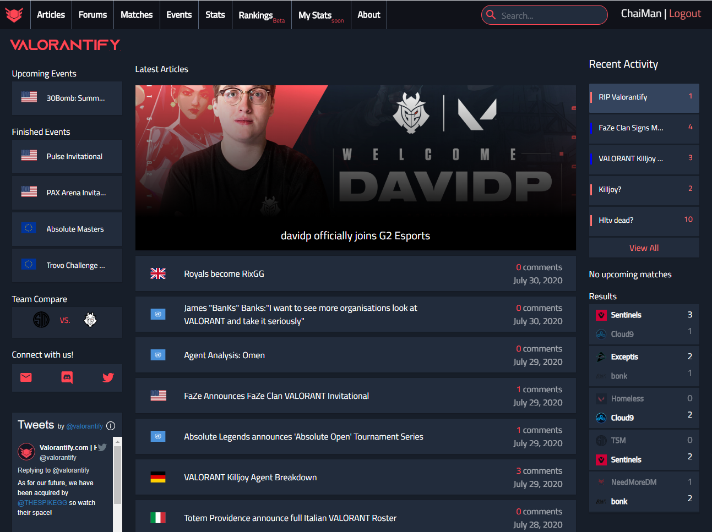

## About Me

I am currently a double major in Computer Science and History at the University of Central Florida, set to graduate in May 2021.

I will be returning to Texas Instruments as a Software Engineer in July 2021. 

From June 2020 to August 2020, I worked as a Software Engineer Intern at Texas Instruments in the ERP Operations Team. 

Since June 2020 I have been a member of the [UCF Computational Biology Lab](https://server.cs.ucf.edu/compbio/), headed by Professor [Wei Zhang](https://www.cs.ucf.edu/~wzhang/). I work primarily under [Jiao Sun](https://server.cs.ucf.edu/compbio/people/).

Since January 2020 I have been a member of the [UCF Evolutionary Computation Lab](http://www.cs.ucf.edu/~ecl/index.html), headed by Professor [Annie Wu](http://www.cs.ucf.edu/~aswu/).

## Portfolio

### Startups

[uBump.co](https://shop.ubump.co) August 2020 - Present

I worked with [Brennen Fountain](https://www.linkedin.com/in/brennen-fountain-743302149/) and [Brett Fazio](https://www.linkedin.com/in/brett-fazio/) to create uBump, an NFC oriented social media sharing site.

Users can simply tap their NFC stickers against a smartphone and instantly share all of their socials. Sample uBump Profile available [here](https://ubump.co/william).

---

[valorantify.com](https://github.com/wanchichen/valorantify-preview) June 2020 - August 2020

I helped develop one of the first VALORANT e-sports sites, which quickly became one of the top statistics and news sources for the budding professional scene. We were eventually acquired by [thespike.gg](https://www.thespike.gg/).

---

### Projects

---

Styling by <a href="https://github.com/evanca/quick-portfolio">evanca</a>

<!-- Remove above link if you don't want to attibute -->
